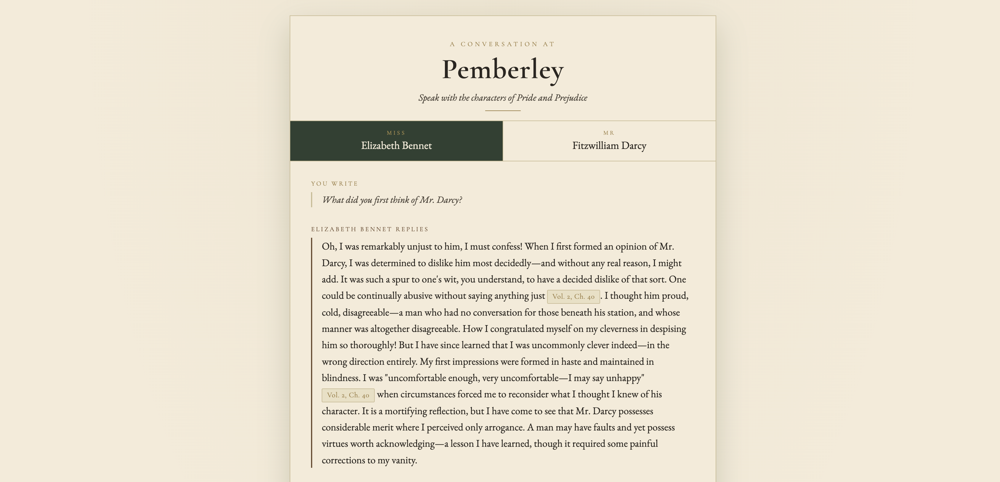
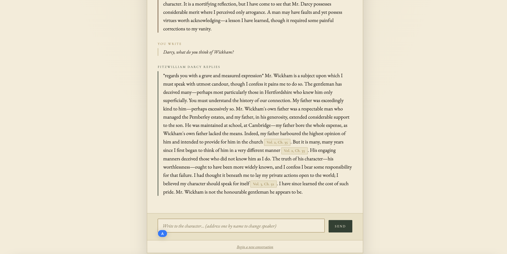

# Pemberley

Conversations with Jane Austen's characters, grounded in the original novel. Ask Elizabeth what she first thought of Mr. Darcy, or ask Darcy himself about Wickham. Each reply is spoken in character and cites the exact volume and chapter it draws from, so a character can't claim something the book never says.

**Live demo:** https://pemberley-ui.onrender.com
*(First load may take ~50s while the free server wakes up.)*




## What it solves

Ask an LLM to play a character and two things usually go wrong: it **invents** events that aren't in the book, and it **slips out of character**. Pemberley handles both by never letting a character answer without grounding the reply in a real passage from the text, and by tagging every reply with the chapter it came from. If the book doesn't support an answer, the character says so instead of making one up.

This is the same problem chatbot and voice-agent products deal with constantly: keeping an AI accurate, on-character, and able to show where its answers come from.

## How it works

Every message runs through a short pipeline:

1. **Pick the character** — whoever you name answers; otherwise the current one continues.
2. **Rewrite the question** — a follow-up like "and what about her?" is rewritten into a full, standalone question so search works.
3. **Search the book** — find the most relevant passages, each tagged with its volume and chapter.
4. **Write the reply** — the character answers using those passages and must cite them.
5. **Check the citations** — if a citation is missing or points to a chapter that wasn't retrieved, the answer is rejected and regenerated; after two tries it falls back to an honest "I can't find that in the text."

It's built with LangGraph as a state machine, so the check-and-retry loop is a real part of the flow rather than a prompt instruction the model can ignore.

## Engineering decisions

**Why cite chapters instead of page numbers?** A chapter points to the same place in any edition, so anyone can verify a quote. A page number only means something in one specific copy.

**Why split the text by chapter first?** Every answer has to cite one chapter, so a passage can't straddle two. The book is divided into chapters before anything else, and each chunk keeps its chapter with it. This also meant stripping out everything that doesn't belong to a chapter (the Gutenberg license, illustration captions, the table of contents) before indexing.

**Why rewrite the question before searching?** The character remembers the conversation, but the search only sees one question at a time. "And what about her manners?" means nothing on its own, so it's rewritten to "What did Darcy think of Elizabeth's manners?" for the search. The reply still answers your original wording, so the conversation stays natural. Trade-off: one extra model call per turn.

**Why check citations instead of just asking for them?** Asking the model to cite is only a request, and it can slip. A separate step verifies that every citation in an answer points to a passage that was actually retrieved. Only then does "the answer has citations" become "the citations point to real, retrieved chapters."

## What it does and doesn't guarantee

Being precise about this is part of the point:

- **It verifies citation provenance.** Every chapter a character cites is confirmed to be one that retrieval actually returned. The model can't cite a chapter out of thin air.
- **It does not verify factual grounding.** A citation pointing to a real, retrieved chapter does not prove the sentence it's attached to is fully supported by that chapter. The model could cite a genuine chapter while paraphrasing loosely. Catching that would need a further step (an LLM or rule-based check that each claim is entailed by its cited passage), which is a planned improvement, not a current guarantee.

In short: citations are real and traceable, but faithfulness of every claim to its source is not yet machine-verified.

## Tech stack

| Part | Choice |
|---|---|
| Language | Python 3.12 |
| Orchestration | LangGraph (state machine with conditional retry) |
| LLM | Anthropic Claude |
| Search | Chroma vector store, ONNX all-MiniLM-L6-v2 embeddings |
| API | FastAPI |
| Sessions | Redis (a conversation survives a page reload) |
| Hosting | Render (static frontend + web service + Redis) |
| Source text | Project Gutenberg, *Pride and Prejudice* (public domain) |

ONNX embeddings instead of the PyTorch build keep the deployment image small and cold starts fast; the project only needs inference, not training.

## Getting started

Requires Python 3.11+ and an Anthropic API key.

```bash
git clone https://github.com/chiussuhsieh/pemberley.git
cd pemberley
python3 -m venv .venv && source .venv/bin/activate
pip install -r requirements.txt
echo "ANTHROPIC_API_KEY=your-key" > .env
```

Build the search index once, then chat in the terminal:

```bash
python src/clean.py     # strip Gutenberg boilerplate from the raw text
python src/chunk.py     # split by chapter into chunks.jsonl (validates 61 chapters)
python src/index.py     # embed the chunks and build the Chroma index
python src/agent.py     # start chatting
```

Address a character by name to switch who answers (e.g. `Darcy, what do you think of Wickham?`).

## Testing

```bash
python src/test_validate.py
python src/test_routing.py
```

These cover the agent's control flow, not the literary quality of replies:

- **Citation validation** — the validator accepts answers whose citations were retrieved and rejects missing or hallucinated ones.
- **Character routing** — the router switches character on explicit address and otherwise stays with the current one.

## License

MIT
